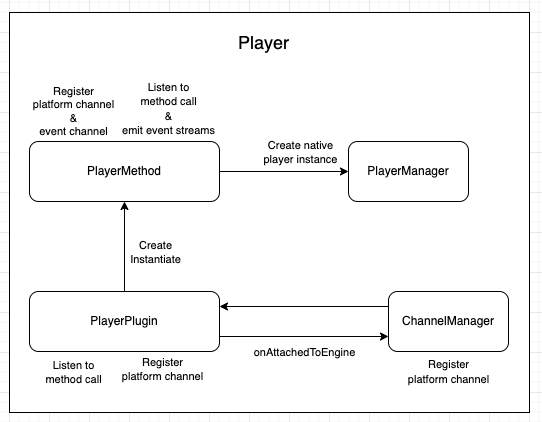
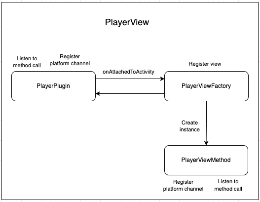

# Android Architecture

The Bitmovin Player Plugin is a Flutter plugin that provides the capability to play video content within a Flutter application. The plugin is designed to be integrated with the Bitmovin Player, a video player that offers various features such as adaptive streaming, DRM, and analytics.

The plugin architecture consists of four main classes: `PlayerPlugin`, `PlayerViewFactory`, `PlayerViewMethod`, and `PlayerMethod`.

The `PlayerPlugin` class is the entry point of the plugin. It implements the `FlutterPlugin` interface, which allows the plugin to be registered with the Flutter engine. It also implements the `MethodCallHandler` interface, which handles incoming method calls from Flutter. The `PlayerPlugin` class also registers the `PlayerViewFactory` with the Flutter platform view registry.

The `PlayerViewFactory` class is responsible for creating and managing the `PlayerViewMethod` instances, which are the platform views that render the video player. The `PlayerViewFactory` implements the `PlatformViewFactory` interface, which creates new instances of the `PlayerViewMethod` class.

The `PlayerViewMethod` class implements the `MethodCallHandler` and `PlatformView` interfaces. It handles method calls from Flutter, such as `BIND_PLAYER` and `UNBIND_PLAYER`, and it creates and manages the PlayerView instance, which is the actual video player view.

The `PlayerMethod` class is responsible for creating and managing the Bitmovin Player instance. It is called by the `PlayerPlugin` class when a new player is created. It receives the player configuration from Flutter, and it creates and initializes the Bitmovin Player instance.

Together, these classes form the core architecture of the Bitmovin Player Plugin. By following this architecture, the plugin is able to integrate with the Bitmovin Player and provide a seamless video playback experience within Flutter applications.

 

## Player

1. When a Flutter app initializes the `PlayerPlugin`, a `MethodChannel` is registered to handle method calls from Flutter via `PlayerPlugin.onMethodCall`.

2. When the Flutter app calls the `CREATE_PLAYER` on the `MethodChannel`, A `PlayerMethod` instance is created and will create a new native `Player` instance by invoking the `create()` method of the `PlayerManager`, the `PlayerManager` is responsible for creating new `Player` instances.

3. The `PlayerMethod` class will register it's own `MethodChannel` and `EventChannel` to receive method calls via the `PlayerMethod.onMethodCall` method and emit `Streams` via the `EventSink` to the Flutter app. At the same time it will also register itself to listen to `Player` events.

    -  `PlayerMethod.onMethodCall` will handle the following method calls
        - play
        - pause
        - mute
        - unmute
        - seek
        - current_time
        - duration
        - loadWithSourceConfig
        - loadWithSource
        - destroy

    - `PlayerMethod.listen()` will be called when the `EventChannel` has been instantiated, and holds a reference of the
    `EventSink` to allow the `PlayerMethod` to emit `Streams` to the Flutter app. 

4. The `PlayerManager` class stores a reference of the `Player` instance. The `PlayerManager` is a singleton class that manages all active `Player` instances.

5. When the Flutter app wants to set a new video source, it sends a method call to the native side with the `SourceConfig`. The `PlayerMethod` class receives the method call via the `PlayerMethod.onMethodCall` and retrieves the Player instance from the `PlayerManager`.

6. The `PlayerMethod` class then calls the load method of the `Player` instance, passing in the `SourceConfig` as a parameter. The `load` method sets the video source for the player and prepares it for playback.

7. When the Flutter app wants to `destroy` a `Player` instance, it sends a method call to the native side with the player ID. The `PlayerMethod` class receives the method call and retrieves the `Player` instance from the `PlayerManager`.

8. The `PlayerMethod` class then calls the `destroy` method of the Player instance, which stops playback, releases resources, and removes the `Player` instance from the `PlayerManager`.

 

## PlayerView

1. The Flutter app sends a method call to the `PlayerPlugin` via a `MethodChannel` to create a new instance of a `PlayerView`.

2. The `PlayerViewFactory` handles the method call and returns a new instance of a `PlayerView`.

3. The Flutter app receives the instance of the `PlayerView` and adds it to the widget tree as a platform view.

4. The `PlayerView` creates an instance of a `Player` internally and sets it as the player for the view.

5. The Flutter app can bind or unbind a `player` to the `PlayerView` by sending method calls via a MethodChannel.

6. When a player is bound to the `PlayerView`, the view sets the player as its player and begins rendering the video playback.

7. When a player is unbound from the `PlayerView`, the view removes the player and stops rendering the video playback.

8. When the `PlayerView` is disposed, it sets its player to null and removes the instance of the player from the `PlayerManager`.