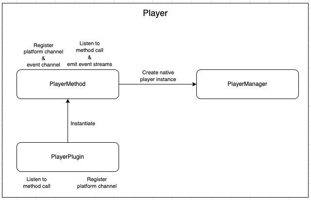
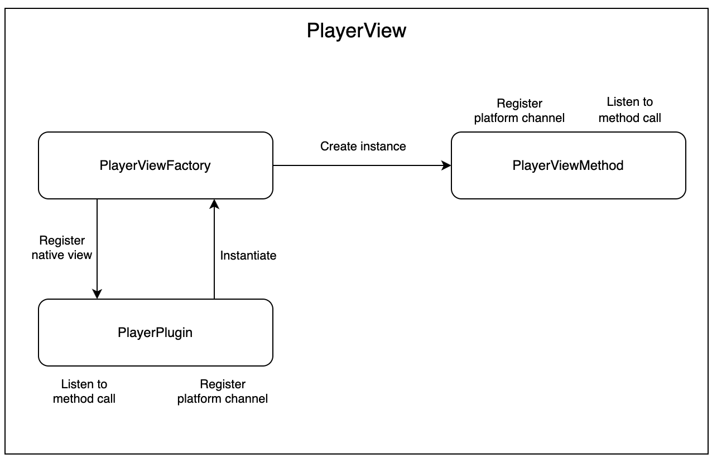

# iOS Architecture

The architecture of the plugin consists of four main components: `PlayerPlugin`, `PlayerNativeViewFactory`, `PlayerViewMethod`, and `PlayerMethod`

`PlayerPlugin` is responsible for registering the plugin with the Flutter engine, handling method calls from the Dart side of the app, and managing the `PlayerMethod`, `PlayerViewMethod` instances.

`PlayerNativeViewFactory` is a factory class that creates and returns instances of `PlayerViewMethod` in response to requests from the Flutter engine.

`PlayerViewMethod` is a class that implements the `FlutterPlatformView` protocol and is responsible for creating and managing the video player view. It also handles method calls from the Dart side of the app related to the player.

`PlayerMethod` is a class that is responsible for creating and managing the player instance. It also handles method calls from the Dart side of the app related to the player.

## Player

1. When the `PlayerPlugin`is called it will register a `MethodChannel` then handles the method call via the `handle` method.
when a method call of `CREATE_PLAYER` is received it will parse the argument pass and build the `PlayerConfig` object it will also parse the `id`, then it will call the `create()` method of the `PlayerMethod`.

2. When the `PlayerMethod` is created it will register it's own `MethodChannel` and `EventChannel` for method calls and emitting streams, The method calls are being handled via `setMethodCallHandler` method of the `MethodChannel` while the `EventChannel` via the `setStreamHandler` and then `create()` method is invoked from the `PlayerManager` this will create an instance of `Player`.

3. The `PlayerManager` class stores a reference of the Player instance. The `PlayerManager` is a singleton class that manages all active `Player` instances.

4. The `PlayerMethod` class then calls the load method of the `Player` instance, passing in the `SourceConfig` as a parameter. The load method sets the video source for the player and prepares it for playback.

 

## PlayerView

1. The Flutter app sends a method call to the `PlayerPlugin` via a `MethodChannel` to create a new instance of a `PlayerView`.

2. The `PlayerViewFactory` handles the method call and returns a new instance of a PlayerView.

3. The Flutter app receives the instance of the `PlayerView` and adds it to the widget tree as a platform view.

4. The `PlayerView` creates an instance of a Player internally and sets it as the player for the view.

5. The Flutter app can bind or unbind a player to the `PlayerView` by sending method calls via a `MethodChannel`.

6. When a player is bound to the `PlayerView`, the view sets the player as its player and begins rendering the video playback.

7. When a player is unbound from the `PlayerView`, the view removes the player and stops rendering the video playback.

8. When the `PlayerView` is disposed, it sets its player to null and removes the instance of the player from the `PlayerManager`.