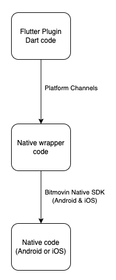

# Architecture Overview

## Flutter Plugin

In this architecture, the **Flutter plugin (Dart code)** communicates with the native code through __platform channels__, which are bridges between **Dart** and **Native Code**.

The native code then interfaces with the 3rd party SDK to perform the required functionality.

The **Native Wrapper** code encapsulates the native code and provides a clean interface to the Dart code.
Finally clear and concise documentation is important for developers to use the plugin correctly.

